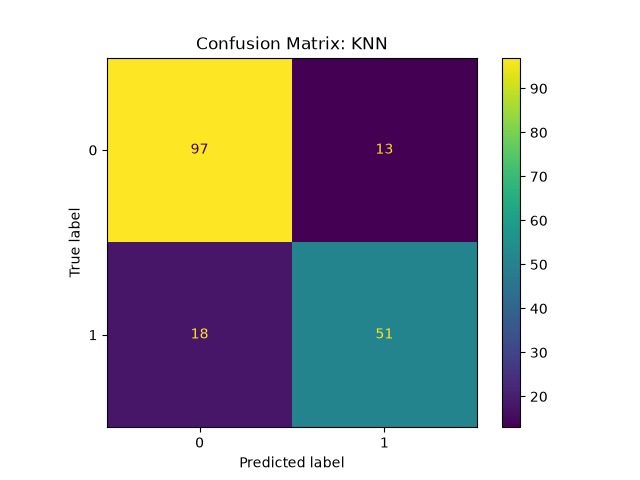

# ml-foundations-comparison

Comparing 6 classical ML algorithms on the Titanic survival dataset.

## Approach
- Cleaned missing values (Age median, Embarked mode, dripped Cabin)
- Encoded categorical features, scaled features for distance-based models
- Trained: Logistic Regression, Decision Tree, Random Forest, SVM, KNN
- Evaluatd on accuracy, precision, recall, F1

## Results
|      | Actual 0 | Actual 1 |
| --- | --- | --- |
| **Predicted 0** | Correct => True Negative | Wrong => False Negative |
| **Predicted 1** | Wrong => False Positive | Correct => True Positive |

Correct: 97 + 51 = 148  
Incorrect: 18 + 13 = 31  
Total: 179

Overall Accuracy: 148/179 = 83%

## Takeaways
[2-3 sentences: which model won, why you think so, one thing you'd try next time]